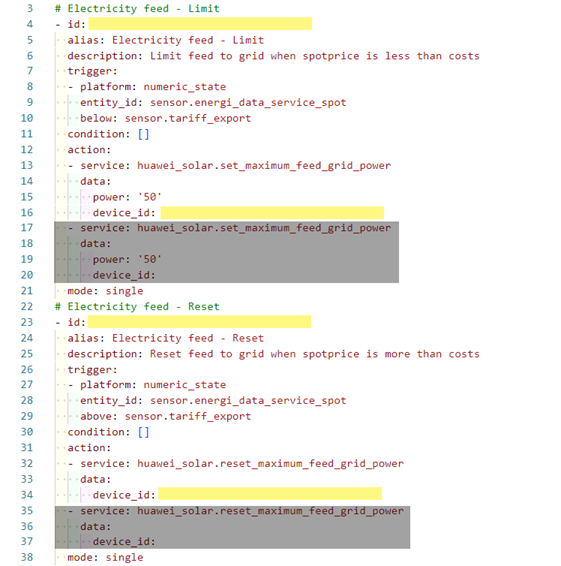

<a href='https://ko-fi.com/U7U1R0IQA' target='_blank'></a>
# Huawei Solar - EFLR
Electricity Feed Limit and Reset

## This repository and README is under revision!

## Project Description
This project will provide you with a set of custom sensors also referred to as the "Huawei Solar EFLR package" to be used in Home Assistant. The package include automations used to limit your feed to grid and reset the feed automatically, based on the current electricity spot price and the price you get for export. This is usefull when it is not profitable to export your solar PV production. The package also includes custom sensors which registers how much solar PV production you have limited and the total of production plus limited solar PV, based on your solar PV forecast.

This README includes a guide on how to set up these automations and necessary sensors up in Home Assistant for your Huawei Solar PV system.

## Table of Content
1. Before You Start
1. Installation<br> 2.1 Tariff Export Sensor<br> 2.2 Electricity Spot Price Sensor<br> 2.3 Electricity Feed Automations<br>2.4 Alternative to Tariff Export Sensor<br> 2.5 Alternative to Energi Data Service Spot Price Sensor
1. Known "bugs"
1. Thanks to

## 1. Before You Start
The custom sensors are all based on only 3 of the power sensors provided by the "Huawei Solar" custom integration by wlcrs - so the margin for error is minimized. You obviously also need a sensor to provide you with the current electrical spot price. I use the "Energi Data Service" custom integration provided by MTrab. The following custom integrations needs to be installed in Home Assistant before you start. Both of the integrations can be installed via HACS.

* **Huawei Solar** integration by wlcrs https://github.com/wlcrs/huawei_solar
* **Energi Data Service** integration by MTrab (or similar integration to fetch the current electricity spot price) https://github.com/MTrab/energidataservice
* **Solacast PV Forcast** integration by oziee https://github.com/oziee/ha-solcast-solar
* **Huawei Solar PEES package** by JensenNick https://github.com/JensenNick/huawei_solar_pees


You also need an editor in Home Assistant in order to be able to edit your configurations.yaml file. I use Studio Code Server (Visual Studio Code) as an Add-on in Home Assistant.

Please note that "this" is not an integration, this is "just" some custom automations and sensors I share.

## 2. Installation
Before jumping into the automations you need to create a couple of custom sensors. One that sums up the costs you have in connection with exporting you excess solar PV production and on sensor that return the electrical spot price.

### 2.1 Tariff Export Sensor
First of all I recommend that you create a custom sensor which add up your tariffs selling your excess solar PV yield, but you can do without this sensor (see below).

With this custom sensor you will have one sensor where you can easily see how your tariffs add up, one place to make changes to your costs and you will have a sensor which you can use in other integrations / custom sensors etc. Copy the custom sensor below to "template: > sensor:" in your configuration.yaml file.

```yaml
template:
  - sensor:
```

```yaml
# Huawei Solar EFLR - Price & Tariff
    - name: "Tariff Export"
      unique_id: tariff_export
      unit_of_measurement: "DKK/kWh"
      state: >-
        
        
        
          
          {{ (
          energinet_indfoedningstarif + 
          energinet_balancetarif + 
          konstant_indfoedningstarif + 
          jyskenergi_balancetarif 
          ) / 100 }}
```
You need to alter the provided custom tariff export sensor to fit to your situation. Do not alter the name or unique id of the sensor.

* Change the tariff cost / price after the equals sign "=" to fit your actual costs / prices. Do pay attention to that these costs / prices are in øre pr. kWh / being divided by 100 in the formula.

* Your net-, electricity- and yield-provider most likely is not the same as mine. You can (you do not have to) change the names or delete them, but make sure you do it both in the "set name" enclosed with  and in the "formula" enclosed by the {{ "the double curly brackets" }} and that you do not alter the distance to the left margin.

You now have a sensor showing the total costs / price that you have to pay when you are exporting 1 kWh of yield produced by your solar PV.

> :bulb: **Quick reload Home Assistant and refresh Your browser!**

#### Alternativ to the Tariff Export Sensor
If you for some reason prefer to add your costs in another way you can do so by just type in your costs as a number. Remember that the value has to be "DKK/kWh" in Denmark. Point is that the costs have to be with the same "unit" as your spot price (sometimes tariffs are not like in DK). Remember to edit this in both automations.

### 2.2 Electricity Spot Price Sensor
It is provided that you have set up the "Energi Data Service" integration via HACS in Home Assistant. If you want to use another method please refer to chapter 2.4.

First add an entry for your "spot price". Go to "Settings" / "Energi Data Service" and click on "Add Entry" and create a new entry named "Energi Data Service - Spot".

* Choose your "Price Area"
* Remove the tick in "Show prices including VAT"
* Leave the "Template for additional cost" without any input.

You now have a entity with the id "sensor.energi_data_service_spot"showing you the current spot price in your area.

> :bulb: **Quick reload Home Assistant and refresh Your browser!**

### 2.3 Electricity Feed Automations
Next step is to add the two automations which respectively will limit your feed to grid when export will cost you money and reset the feed to grid once the electricity spot price once again raise above this lower limit.

Copy the custom automations from the file "1_electricity_feed_automations.yaml" to your automations.yaml file.

Link to the power sensors [1_electricity_feed_automations.yml](1_electricity_feed_automations.yml)

Now you have a little bit of editing to do, so if you are not used to do this, take your time and make sure you get it right. This will save you a lot of headache. Below is a picture with the lines marked that you need to have a look at.

* **id:** I recomend that you leave the automations without an id. just set it leave id as `[]`. If you set an `id` the automation will become it editable in the GUI - but it will be rmoved from your package file and put in the file with all your other GUI autimations and make it harder to identify.

* **power:** With this value set at "50" you are letting the Huawei Solar PV to export up to 50 W of power. Power will always flow in one or the other direction, so by setting this value to e.g. 50 or 100 W you prevent the system from buying electricity. You can set this value to 0 W, at the risk that you may occasionally buy a small amount of electricity even with this automation in effect.

* **device_id:** You have to find the device ID of you inverter and insert it here. The easiest way is to go to "Settings" / "Automations & scenes",click "Create automation" and "Create new automation". Click on "Add trigger" and choose "Device". In the "Device" dropdown menu, search for "Inverter" and chose your inverter.<br>
Now click on the three dots in the upper right corner of the window named "Trigger" and choose "Edit in YAML". Copy or note down your "device id". Do not save! Click on the "arrow back" in the upper left corner and click on "Leave".<br>
Now open the automations.yaml file again and paste your "device id" into the line that named "device_id:" with one spacing to the colon.



The provided automations are prepared for a setup with two inverters. If that is not the case for you, you can delete the lines marked with grey color. Pay attention not to delete the last line "mode: single".

If you have two inverters (or more) you need to fill in the same lines as described above for each inverter in the greyed lines. If you have more than two inverters you can copy these lines and paste them in. Make sure you edit both automations.

> :bulb: **Quick reload Home Assistant and refresh Your browser!**

### 2.4 Alternative to Tariff Export Sensor

* **bellow: and above:** If you did not create the Tariff Export Sensor you can replace the named sensor with the numeric value that fits your situation or another sensor.

### 2.5 Alternative to Energi Data Service Spot Price Sensor

* **entity_id:** If you did not create a sensor with the electricity spot price according to the guide above, you can replace this sensor with the sensor you want to use.

## 3. Known "bugs"
None at the moment.

## 4. Thanks to
**A huge thanks to;**

* **wlcrs** for providing the "Huawei Solar" integration. This integration is essential for anyone who wish to integrate their Huawei Solar PV in Home Assistant.

* **MTrab** for providing the "Energi Data Service" integration. This integration is essential for all of us trying to keep up with the electricity prices and the complex and ever-changing tariffs in DK.

**Again, Thank You to both of You!**
